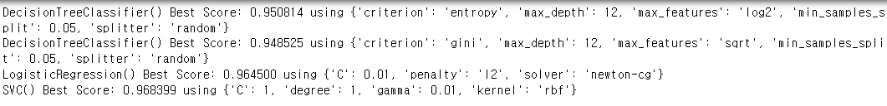
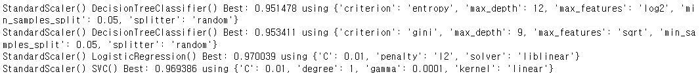

# ML-PHW1
## Compare the performance (i.e., accuracy) of the following classification models against the same dataset.
+ Various data scaling methods and encoding methods
+ Various values of the model parameters for each model
+ Various values for the hyperparameters
+ Various numbers 𝑘 for 𝑘-fold cross validation

## [Code with User Manual](https://github.com/gochangin-ai/ML-PHW1/blob/main/README.md#Code With User Manual) <
## [Results](https://github.com/gochangin-ai/ML-PHW1/blob/main/README.md#results) <

# Code With User Manual
## Importing necessary libraries
#### Make sure that you have all these libaries available to run the code successfully
```python
import numpy as np
import pandas as pd
import warnings

# Data processing
from sklearn.model_selection import train_test_split
from sklearn.preprocessing import StandardScaler, MinMaxScaler, RobustScaler
from sklearn.preprocessing import LabelEncoder

# Model import
from sklearn.linear_model import LogisticRegression
from sklearn.tree import DecisionTreeClassifier
from sklearn.svm import SVC

#Hyper params tuning
from sklearn.model_selection import GridSearchCV
from sklearn.model_selection import RepeatedStratifiedKFold
from sklearn.metrics import accuracy_score
from sklearn.model_selection import KFold

#plot image
from sklearn.tree import plot_tree
from matplotlib import pyplot as plt

#draw tree
import pydotplus
from pydotplus import graph_from_dot_data
from sklearn.tree import export_graphviz
from IPython.display import Image
from PIL import Image
import time
```

## Model Training Function
#### Parameter : models   |   list that you want to use DecisionTreeClassifier(),LogisticRegression(),SVC()
####            x_train, x_text, y_train , y_test | Data that you want to train
####            k  |  paramter for k-fold CV
```python
def Model_train(models,x_train, x_test, y_train, y_test,k):
    cnt = 0
    train_best_scores = [[0] * 4 for _ in range(4)]
    test_best_scores = [[0] * 4 for _ in range(4)]

    for i in models:
        cv = RepeatedStratifiedKFold(n_splits=k, n_repeats=5, random_state=42)
        grid_search = GridSearchCV(estimator=i, param_grid=dict(models[i].items()), cv=cv, scoring='accuracy', error_score=0)
        grid_result = grid_search.fit(x_train,y_train.values.ravel())
        estimatior = grid_result.best_estimator_
        y_pred = estimatior.predict(x_test)

        model_name = str(i)
        if model_name == "DecisionTreeClassifier()":
            dot_data = export_graphviz(estimatior, filled=True, rounded=True, class_names="Class",
                                       feature_names=data.columns.tolist(), out_file=None)
            tree = graph_from_dot_data(dot_data)
            image_name = time.strftime('%H%M%S') +'.png'
            tree.write_png(image_name)
            image = Image.open(image_name)
            image.show()

        # summarize results
        print("%s Best Score: %f using %s" % (i, grid_result.best_score_, grid_result.best_params_))
        train_best_scores[cnt] = grid_result.best_score_
        test_best_scores[cnt] = accuracy_score(y_test, y_pred)
        cnt += 1;

    return train_best_scores, test_best_scores
```    
## Data Preprocessing
#### Read data and Deal with missing values and change target class value(2,4) to (0,1)
#### Parameter : data_path   |  path of 'breast-cancer-wisconsin.data' file 

```python
def DataProcessing(data_path):
    dataset_df = pd.read_csv(data_path, header=None)

    # Insert Colum data
    dataset_df.columns = ['ID', 'Clump Thickness', 'Uniformity of Cell Size', 'Uniformity of Cell Shape',
                          'Marginal Adhesion',
                          'Single Epithelial Cell Size', 'Bare Nuclei', 'Bland Chromatin', 'Normal Nucleoli', 'Mitoses',
                          'Class']

    dataset_df = dataset_df.apply(pd.to_numeric, errors='coerce').fillna(np.nan).dropna()

    data = dataset_df.iloc[:, 1:10]
    data = data.astype(np.int32)

    # Change Class value 2,4 to 0,1
    target = dataset_df.iloc[:, [-1]]
    encoder = LabelEncoder()
    target.loc[:,'Class'] = encoder.fit_transform(target.loc[:, 'Class'])

    return data, target
```
## Model_scaled 
### Train Model with scalers 

#### Parameter :scalers  |   Scalers that you want to use
####            models   |   list that you want to use DecisionTreeClassifier(),LogisticRegression(),SVC()
####            x_train, x_text, y_train , y_test | Data that you want to train
####            k  |  paramter for k-fold CV
```python
def Model_scaled(scalers,models,x_train, x_test, y_train, y_test,k):
    train_best_scores = [[0] * 4 for _ in range(4)]
    test_best_scores = [[0] * 4 for _ in range(4)]
    for i in scalers:
        x_test_scaled=i.fit_transform(x_test)
        x_train_scaled=i.fit_transform(x_train)
        scaled_view(i,x_train,x_test,x_train_scaled,x_test_scaled)
        cnt = 0

        for j in models:
            cv = RepeatedStratifiedKFold(n_splits=k, n_repeats=5, random_state=42)
            grid_search = GridSearchCV(estimator=j, param_grid=dict(models[j].items()),  cv=cv, scoring='accuracy',error_score=0)
            grid_result = grid_search.fit(x_train_scaled,y_train.values.ravel())
            estimatior = grid_result.best_estimator_
            y_pred = estimatior.predict(x_test_scaled)

            model_name = str(j)
            if model_name == "DecisionTreeClassifier()":
                dot_data = export_graphviz(estimatior, filled=True, rounded=True, class_names="Class",
                                           feature_names=data.columns.tolist(), out_file=None)
                tree = graph_from_dot_data(dot_data)
                image_name = time.strftime('%H%M%S') + '.png'
                tree.write_png(image_name)
                image = Image.open(image_name)
                image.show()

            # summarize results
            print("%s %s Best: %f using %s" % (i, j, grid_result.best_score_, grid_result.best_params_))

            train_best_scores[scalers.index(i)][cnt] = grid_result.best_score_
            test_best_scores[scalers.index(i)][cnt] = accuracy_score(y_test, y_pred)
            cnt += 1;

    return train_best_scores, test_best_scores
```

## plt_view
### Display each train,test socre of models at each k-fold  
#### Parameter :train_bestScore | result train score of model trained
#### test_bestScore | result train score of model trained 
#### scaled_train_bestScore |   result train score of model trained with scaled data
#### scaled_test_bestScore |  result tes score of model trained with scaled data
#### k | used k-fold parameter k
```python
def plt_view(train_bestScore,test_bestScore,scaled_train_bestScore,scaled_test_bestScore,k):
    plt.figure(figsize=(10, 4))
    x = ['Decision(Entorpy)', 'Decision(Gini)', 'Logistic', 'SVM']
    plt.subplot(2, 1, 1)
    plt.ylim(0.8,1)
    plt.plot(x, train_bestScore, marker='o', lw=1.5, label='No Scaler')
    plt.plot(x, scaled_train_bestScore[0], marker='o', lw=1.5, label='Standard Scaler')
    plt.plot(x, scaled_train_bestScore[1], marker='o', lw=1.5, label='MinMiax Scaler')
    plt.plot(x, scaled_train_bestScore[2], marker='o', lw=1.5, label='Robust')
    plt.legend(loc=0)
    plt.grid(True)

    plt.xlabel('Model')
    plt.ylabel('Acc')
    plt.title('Train Model Acc '+str(k)+'-fold')

    plt.subplot(2, 1, 2)
    plt.ylim(0.8, 1)
    plt.plot(x, test_bestScore, marker='o', lw=1.5, label='No Scaler')
    plt.plot(x, scaled_test_bestScore[0], marker='o', lw=1.5, label='Standard Scaler')
    plt.plot(x, scaled_test_bestScore[1], marker='o', lw=1.5, label='MinMiax Scaler')
    plt.plot(x, scaled_test_bestScore[2], marker='o', lw=1.5, label='Robust')
    plt.legend(loc=0)
    plt.grid(True)

    plt.xlabel('Model')
    plt.ylabel('Acc')
    plt.title('Test Acc '+str(k)+'-fold')
    plt.show()
```


## plt_view_bar
### Display each train,test socre of models at each scalers 
#### Parameter :train_bestScore | result train score of model trained
#### test_bestScore | result train score of model trained 
#### scaled_train_bestScore |   result train score of model trained with scaled data
#### scaled_test_bestScore |  result tes score of model trained with scaled data
#### k | used k-fold parameter k
```python
def plt_view_bar(train_bestScore,test_bestScore,scaled_train_bestScore,scaled_test_bestScore,k):
    models = ['Decision(Entorpy)', 'Decision(Gini)', 'Logistic', 'SVM']
    for i in range(4):
        plt.figure(figsize=(15, 6))
        x = ['No Scaler','No Scaler test', 'Standard Scaler','Standard Scaler test', 'MinMax Scaler', 'MinMax Scaler test','Robust Scaler','Robust Scaler test']
        plt.subplot(2, 1, 1)
        plt.ylim(0.75, 1)
        plt.bar(x[0], train_bestScore[i],  label='No Scaler',color='green')
        plt.bar(x[1], test_bestScore[i], label='No Scaler',color='red')
        plt.bar(x[2], scaled_train_bestScore[0][i], label='Standard Scaler',color='green')
        plt.bar(x[3], scaled_test_bestScore[0][i], label='Standard Scaler',color='red')
        plt.bar(x[4], scaled_train_bestScore[1][i], label='MinMax Scaler',color='green')
        plt.bar(x[5], scaled_test_bestScore[1][i], label='MinMax Scaler',color='red')
        plt.bar(x[6], scaled_train_bestScore[2][i], label='Robust',color='green')
        plt.bar(x[7], scaled_test_bestScore[2][i],  label='Robust',color='red')
        plt.xlabel(models[i])
        plt.ylabel('Acc')
        plt.title(str(k)+'-fold')
        plt.show()
```


## scaled_view
### Display changed value of scaled data
#### Parameter :scaler | scaler
#### raw_train_x | raw train_x data
#### raw_test_x | raw test_x data
#### transformed_train_x | transformed train_x data
#### transformed_test_x | transformed train_y data
```python
def scaled_view(scaler,raw_train_x,raw_test_x,transformed_train_x,transformed_test_x):

    f, axes = plt.subplots(3, 6)
    scaled_df =  pd.DataFrame(transformed_train_x, columns=['Clump Thickness', 'Uniformity of Cell Size', 'Uniformity of Cell Shape',
                          'Marginal Adhesion',
                          'Single Epithelial Cell Size', 'Bare Nuclei', 'Bland Chromatin', 'Normal Nucleoli', 'Mitoses'])
    plt.suptitle('Comparison of raw data with scaled data',fontsize=10)
    # size
    f.set_size_inches((30, 20))
    # margin
    plt.subplots_adjust(wspace = 1, hspace = 0.6)
    col = 0
    for i in range(3):
        for j in range(6):
            if(j%2 == 0):
                axes[i,j].hist(raw_train_x.iloc[ : , col],color='green',edgecolor='black')
                axes[i, j].set_title("raw - " + scaled_df.columns[col])
            else:
                axes[i,j].hist(scaled_df.iloc[ : , col],color='yellow',edgecolor='black')
                axes[i, j].set_title(str(scaler) +" - " +scaled_df.columns[col])
                col += 1

    plt.show()
```
## kfold
### train models for each k fold 
#### Parameter :scalers | scalers you want to use
#### models | models you want to use
#### x_training_set | train x data that you use
#### x_test_set | test x data that you use
#### y_training_set | train  y data that you use
#### y_test_set | test y data that you use
#### k | k-fold k parameter you want to use
```python
def kfold(scalers,models,x_training_set, x_test_set, y_training_set, y_test_set,k):

    for i in k:

        train_bestScore,test_bestScore = Model_train(models,x_training_set, x_test_set, y_training_set, y_test_set,i)
        scaled_train_bestScore,scaled_test_bestScore = Model_scaled(scalers,models,x_training_set, x_test_set, y_training_set, y_test_set,i)

        plt_view(train_bestScore,test_bestScore,scaled_train_bestScore,scaled_test_bestScore,i)
        plt_view_bar(train_bestScore,test_bestScore,scaled_train_bestScore,scaled_test_bestScore,i)
```


## main code 
### set scalers, models, k, data_path and run for train models
```python
warnings.filterwarnings(action='ignore')

scalers = [StandardScaler(),MinMaxScaler(), RobustScaler()]
models = {DecisionTreeClassifier() : {
    'criterion' : ['entropy'],
    'max_depth': [None, 6, 9, 12],
    'min_samples_split': [0.01, 0.05, 0.1,1],
    'splitter': ['best', 'random'],
    'max_features': [ 'sqrt', 'log2']
    },
    DecisionTreeClassifier() : {
    'criterion' : ['gini'],
    'max_depth': [None, 6, 9, 12],
    'min_samples_split': [0.01, 0.05, 0.1,1],
    'splitter': ['best', 'random'],
    'max_features': ['sqrt', 'log2']
    },
    LogisticRegression() : {
    'penalty' : ['l1', 'l2', 'elasticnet',None],
    'solver' : ['liblinear', 'newton-cg', 'lbfgs'],
    'C' : [0.01, 0.1, 1 ],
    },
    SVC() : {
    'degree' : [1,2,3,4,5],
    'kernel' : ['linear','rbf','poly','sigmoid'],
    'C' : [0.01, 0.1, 1],
    'gamma':[0.0001, 0.001, 0.01, 0.1, 1]
    }}
k = [5,8,10]

data_path = 'breast-cancer-wisconsin.data'
data , target = DataProcessing(data_path)

x_training_set, x_test_set, y_training_set, y_test_set = train_test_split(data, target, test_size=0.10, random_state=42, shuffle=True)
kfold(scalers,models,x_training_set, x_test_set, y_training_set, y_test_set,k)
```


# Results








